# 🌐 Vinay K R — Senior GenAI & Applied AI Systems Engineer Portfolio

[](https://portfolio.vinaykr.workers.dev/)
[](https://angular.dev/)
[](https://www.typescriptlang.org/)
[](https://vitejs.dev/)
[](https://tailwindcss.com/)
[](https://workers.cloudflare.com/)

A high-performance, dark-themed, glassmorphic portfolio and interactive GenAI engineering showcase built with **Angular 22 Signals**, **Vite**, **Tailwind CSS**, and **Cloudflare Workers**.

---

## 🏛️ Component Architecture & Visual Hierarchy

```mermaid
graph TD
    AppRoot[app-root / App Shell] --> ScrollNav[app-scroll-nav / Sticky Progress Indicator]
    AppRoot --> Particles[app-particles / Dynamic Canvas Background]
    AppRoot --> Navbar[app-navbar / Glassmorphic Floating Header]
    
    subgraph MainContent["📱 Single Page Application Sections"]
        Navbar -.-> Hero[app-hero / Animated Rotating Titles & Bio]
        Navbar -.-> About[app-about / Systems & AI Background]
        Navbar -.-> Skills[app-skills / 6 Interactive AI Pillars]
        Navbar -.-> Showcase[app-angular-showcase / Live Reactive Forms & RxJS]
        Navbar -.-> Experience[app-experience / Interactive Career Journey Timeline]
        Navbar -.-> Resume[app-resume / Web & PDF Resume with Theme Switcher]
        Navbar -.-> Projects[app-projects / Flagship GenAI & Systems Showcase]
        Navbar -.-> GitHubSec[app-github / Real-Time GitHub Activity & Pinned Repos]
        Navbar -.-> MajorProject[app-major-project / ML Data Visualization Capstone]
        Navbar -.-> Certs[app-certifications / Verified Credentials & Modal Previews]
        Navbar -.-> Contact[app-contact / Web3Forms Messaging & Socials]
    end

    AppRoot --> Footer[app-footer / Copyright & Direct Links]
```



---

## ✨ Key Technical Features

### 1. 📄 Dual-Mode Interactive Resume Engine (`app-resume`)
- **Web Resume Mode:** High-density, structured view detailing 3+ years of experience across Liminal Custody and Light & Wonder, technical skill matrices, and scale proof.
- **Embedded PDF Viewer:** Integrated PDF viewer displaying the official **Times New Roman Monochrome Resume** with client-side dark/light mode filtering (`auto`, `🌙 Dark`, `☀️ Light`) and direct download links.

### 2. ⚡ Modern Angular 22 Reactivity & Signals
- Built entirely with **Angular Signals (`signal()`, `computed()`, `effect()`)** and standalone components for zero-overhead, fine-grained reactivity.
- **Zoneless-ready** architecture ensuring optimal frame rates and immediate DOM updates.

### 3. 🧪 Live Reactive Forms Demo (`app-angular-showcase`)
- Live, interactive form replicating enterprise transaction firewall policy engines (FormBuilder, custom validators, real-time error states, and RxJS stream debouncing).

### 4. 🎨 Apple-Inspired Glassmorphism & Smooth Inertia
- Custom frosted glass styling (`backdrop-blur-md`, subtle specular borders, and gradient backdrops).
- Inertia smooth scrolling powered by **Lenis**.
- 3D perspective hover cards using custom standalone directives (`appTilt`).

### 5. 🌍 Edge-Accelerated Deployment
- Deployed on **Cloudflare Workers / Pages** edge network for global sub-50ms Time-to-First-Byte (TTFB) and automatic SSL termination.

---

## 🛠️ Tech Stack & Tooling

| Domain | Technologies |
|---|---|
| **Framework** | Angular 22 (Standalone Components, Signals, reactive primitives) |
| **Language** | TypeScript 5.8+ |
| **Bundler & Dev Server** | Vite 7.3 (Sub-2s production builds) |
| **Styling** | Tailwind CSS 3.4, PostCSS, Custom Apple Glassmorphism Utilities |
| **Smooth Scrolling** | Lenis Scroll |
| **Hosting & Edge** | Cloudflare Workers / Cloudflare Pages |
| **Form Handling** | Angular Reactive Forms (`FormGroup`, `FormControl`, `Validators`) |
| **Icons & Media** | Inline SVG Vector Icons & WebP compressed assets |

---

## ⚡ Quickstart & Local Development

### 1. Clone the Repository
```bash
git clone https://github.com/vi-nayKR/Portfolio-Ng.git
cd Portfolio-Ng
```

### 2. Install Dependencies
```bash
npm install
```

### 3. Start Development Server
```bash
npm run dev
```
Open [http://localhost:5173](http://localhost:5173) in your browser.

### 4. Build for Production
```bash
npm run build
```
Generates optimized static assets in the `dist/` directory in under 2 seconds.

### 5. Preview Production Build
```bash
npm run preview
```

---

## 👤 Author & Contact

**Vinay K R** — *Senior GenAI & Applied AI Systems Engineer*  
- 🌐 **Live Portfolio:** [portfolio.vinaykr.workers.dev](https://portfolio.vinaykr.workers.dev/)  
- 💼 **LinkedIn:** [linkedin.com/in/vi-naykr](https://linkedin.com/in/vi-naykr)  
- 🐙 **GitHub:** [github.com/vi-nayKR](https://github.com/vi-nayKR)  
- 📧 **Email:** [vinayravindranatha@gmail.com](mailto:vinayravindranatha@gmail.com)  
- 📍 **Location:** Bengaluru, India
